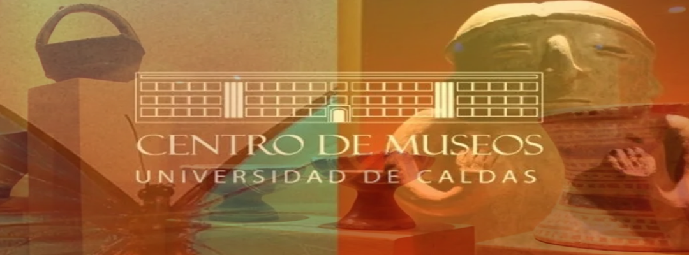

<h1 align="center"> FelipedelosH </h1>
 
<h4>MUSEO-A&E-UCALDAS</h4>

:construction: IN CONSTRUCTION :construction:
  
Welcome to the UCaldas Ethnographic and Archaeological Museum! 🏛️ In this project, we’ve created an interactive website that immerses you in the cultural and archaeological richness of our region.

## :hammer:Funcionalidades del proyecto

- `Function 1`: Explore Our Heritage: Discover unique artifacts that connect us to past societies. From ceramics to textiles, each object tells a story. 
- `Function 2`: Responsive Design: Our page adapts seamlessly to any device, whether you’re exploring from your computer or your mobile phone. 
- `Function 3`: Stunning Animations: We’ve used AOS (Animate On Scroll) to breathe life into elements as you scroll. It’s like a stylish time-travel experience! 

## :play_or_pause_button:How to execute a project

Double click in index.html

## :hammer_and_wrench:Tecnologías.

- HTML
- JavaScript
- Bootstrap
- CSS
- AOS
- 3D 

## :warning:Advertencia

- all content is hardcoded.

## Autor

| [ Andrés Felipe Hernánez](https://github.com/felipedelosh)|
| :---: |